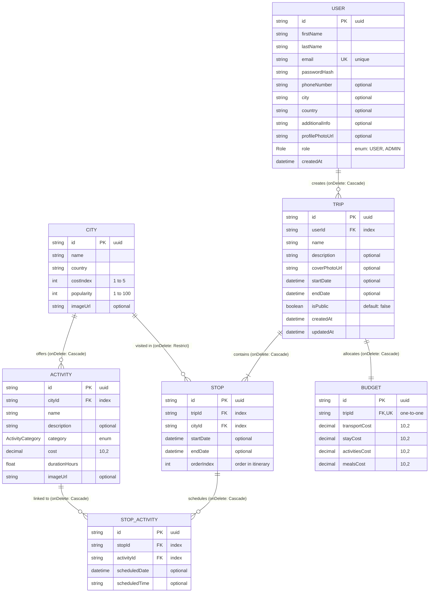

# GlobeTrotter - Entity Relationship Diagram & Data Dictionary

Below is the complete database model for the **GlobeTrotter** multi-city travel planning platform.

## Mermaid ER Diagram

---

## Data Dictionary & Relationships Summary

### Enums
- **`Role`**: `USER`, `ADMIN`
- **`ActivityCategory`**: `SIGHTSEEING`, `FOOD`, `ADVENTURE`, `CULTURE`, `RELAXATION`, `OTHER`

### Model Indexes & Foreign Keys
1. **`User`**: Primary key `id`. Unique constraint on `email`.
2. **`Trip`**: Index on `userId`. Foreign key to `User(id)` with `onDelete: Cascade`.
3. **`City`**: Primary key `id`. Unique composite constraint on `(name, country)`.
4. **`Stop`**: Indexes on `tripId` and `cityId`. Foreign keys to `Trip(id)` (`onDelete: Cascade`) and `City(id)` (`onDelete: Restrict`).
5. **`Activity`**: Index on `cityId`. Foreign key to `City(id)` with `onDelete: Cascade`.
6. **`StopActivity`**: Indexes on `stopId` and `activityId`. Foreign keys to `Stop(id)` (`onDelete: Cascade`) and `Activity(id)` (`onDelete: Cascade`).
7. **`Budget`**: One-to-one unique foreign key to `Trip(id)` with `onDelete: Cascade`.
