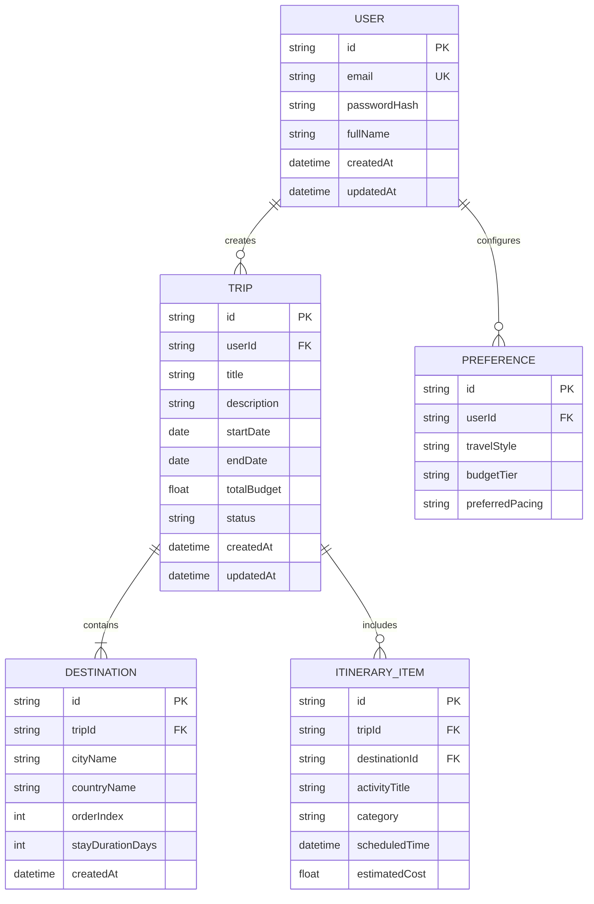

# GlobeTrotter - ER Diagram & Data Model

## Entity Relationship Overview

```mermaid
erDiagram
    USER ||--o{ TRIP : creates
    TRIP ||--|{ DESTINATION : contains
    TRIP ||--o{ ITINERARY_ITEM : includes
    USER ||--o{ PREFERENCE : configures

    USER {
        string id PK
        string email UK
        string passwordHash
        string fullName
        datetime createdAt
        datetime updatedAt
    }

    TRIP {
        string id PK
        string userId FK
        string title
        string description
        date startDate
        date endDate
        float totalBudget
        string status
        datetime createdAt
        datetime updatedAt
    }

    DESTINATION {
        string id PK
        string tripId FK
        string cityName
        string countryName
        int orderIndex
        int stayDurationDays
        datetime createdAt
    }

    ITINERARY_ITEM {
        string id PK
        string tripId FK
        string destinationId FK
        string activityTitle
        string category
        datetime scheduledTime
        float estimatedCost
    }

    PREFERENCE {
        string id PK
        string userId FK
        string travelStyle
        string budgetTier
        string preferredPacing
    }
```
